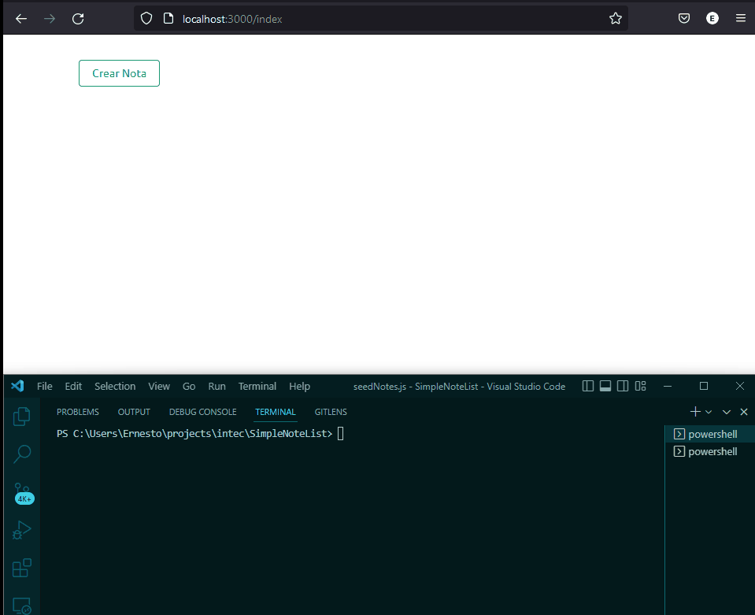

# Práctica Aplicación de DevOps & 12 Factores

La presente práctica busca que cada estudiante ponga en práctica varios de los conceptos de Aplicación de 12 factores o _12 Factors App_ junto con un Pipeline de CI. Se tiene un proyecto escrito en Node.JS el cual es una simple aplicación de tomar notas. La misma utiliza un servidor MongoDB para almacenar los datos.

## Pipeline CI

Este proyecto ha de ser validado utilizando un flujo de Integración Contínua (*CI*), recordando que la fase de Integración es la fase en la que validamos que los cambios que hemos realizado son válidos y compatibles con el estado actual del proyecto. Dicho esto, han de escoger un proveedor de flujos o _Pipelines_ (entre ellos Github Actions, CircleCI, Gitlab CI/CD, Azure Pipelines, TeamCity, etc.) de su preferencia, e implementar:

1. Configuración de entorno (recursos como instalación de Node, carga de variables de ambiente, servidor de base de datos, etc.)
2. Instalación de Dependencias.
3. Pruebas Unitarias.
4. Análisis del código (_linting_) utilizando ESLint.

# 12 Factores

El proyecto es poco maduro en cuanto a la implementación de estándarres de desarrollo. Por ello se solicita a los equipos el que implemente los siguientes principios:

1. Repositorio (_code base_).
1. Dependencias.
1. Configuración.
1. Servicios de Apoyo.
1. Procesos.
1. Concurrencia.
1. Exposición de Puertos.
1. Agilidad (_disposability_).
1. Procesos Administrativos.

Los factores Separación de Etapas (*Build, Release, Run*), Homogeneidad de Ambientes (_Dev/Prod Parity_), y *Logs* lo estaremos tratando en una próxima práctica.

### Dependencias

Este proyecto funciona apropiadamente con las siguientes dependencias y versiones:

- Dependencias del Proyecto
  - body-parser. Versión: 1.19.0
  - dotenv. Versión: 16.3.1
  - express. Versión: 4.17.1
  - mongoose. Versión: 5.9.10
  - promise. Versión: 8.1.0
  - pug. Versión: 3.0.1

- Dependencias de desarrollo y CI/CD
  - cross-env
  - jest
  - supertest
  - eslint
  - eslint-config-google

## Consideraciones

- Se espera que no registren en el repositorio contenido generado.
- Se espera que no registren en el repositorio contenido sensible (credenciales, por ejemplo).
- Se espera que se considere a MongoDB como un servicio de apoyo, viendo a este como un recurso que se utiliza dentro del proyecto y pueda ser sustituido con facilidad.
- Se espera que con el comando `npm run cluster` puedan correr el proyecto en modo multiprocesos (varios hilos del procesador).
- Se espera que se puedan cargar datos de prueba en el proyecto con el comando `npm run seed`, estos datos originarios de `notes.json`.
- Se espera que se pueda verificar el correcto funcionamiento del proyecto con el comando `npm run test`.
- Se espera que se pueda verificar el correcto funcionamiento del proyecto con el comando `npm run lint`.
- Se espera que el pipeline de CI se ejecute en cada _push_ a la rama pricincipa, y/o _pull request_.
- Se espera que el pipeline de CI **falle** ante un error en las pruebas unitarias o en el _linting_.
